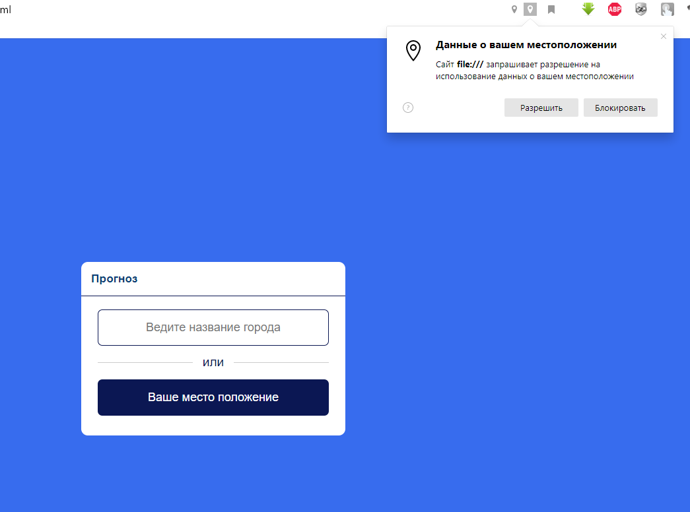
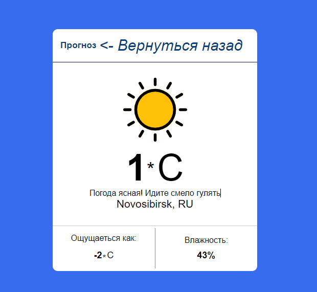

# Проект на JS

Простой js пример api, с помощью сайта https://api.openweathermap.org/ , а также определения Вашего место положения
>__Пример можно посмотреть на странице:__
>[Ссылка на страницу просмотра](https://vladjutnik.github.io/weather-forecast/)
>---
>__Пример:__
>
>

